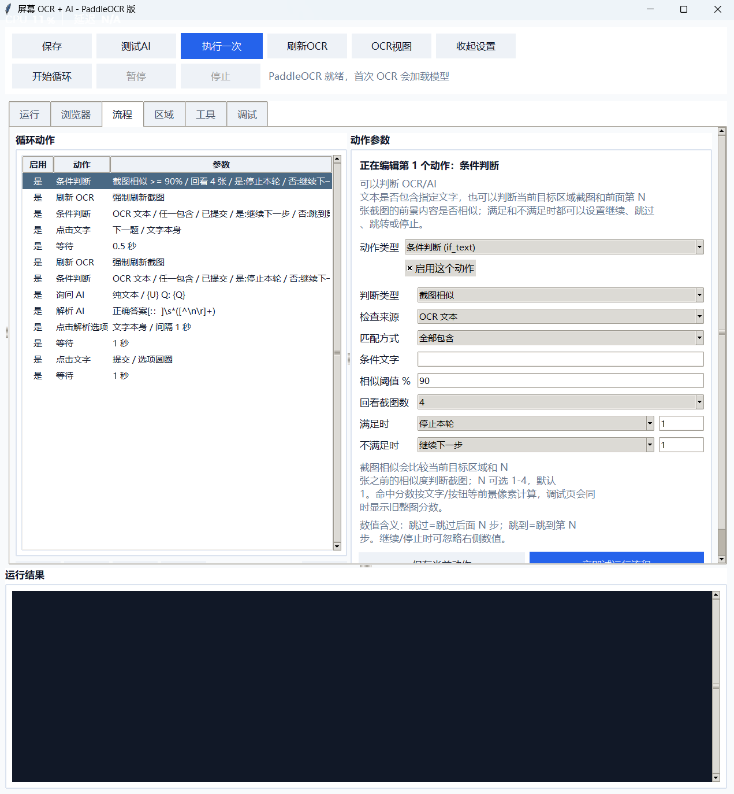
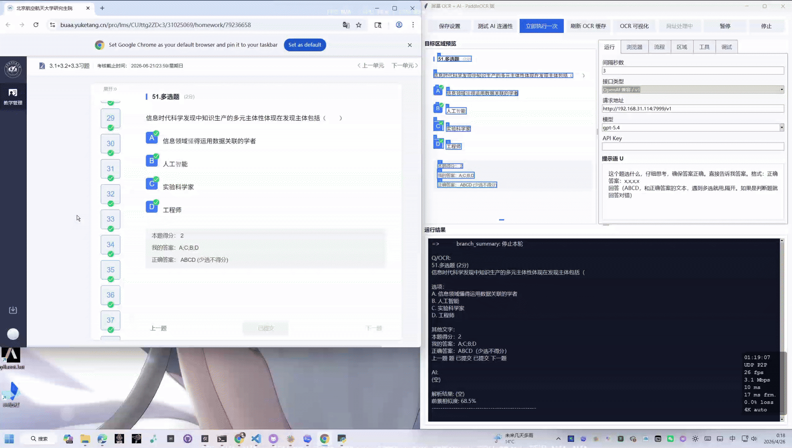
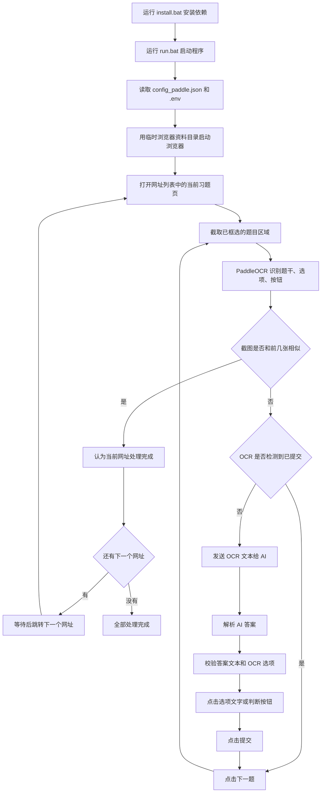

# 屏幕 OCR + AI 自动答题工具

这是一个 Windows 桌面工具。程序会截取浏览器里的雨课堂题目区域，使用 PaddleOCR 识别题干、选项和按钮，再把题目发给 AI，解析答案并自动点击选项、提交、切换下一题。浏览器批处理模式可以按网址列表逐个习题自动运行。

当前主要入口是 `app_paddle.py`。旧版 `app.py` 仍保留 Tesseract 流程，但日常建议使用 PaddleOCR 版。

> 请只在你有权限自动化操作的页面中使用，并遵守课程、平台和学校的相关规则。公开仓库不包含个人登录信息或 API Key；示例配置中的网址列表是你选择同步的默认设置。

## 功能亮点

- 使用 PaddleOCR 识别浏览器里的题干、选项、提交按钮和下一题按钮。
- 支持 OpenAI 兼容接口与 Gemini/Sub2API 类接口，可切换模型。
- 默认只把 OCR 文本发给 AI；需要时可以手动开启截图上传。
- 支持单选、多选、判断题，点击选项文字而不是只依赖 A/B/C/D 字母。
- 可按网址列表批量处理多个习题页面，当前页面结束后自动跳到下一个网址。
- 通过截图相似度判断当前网址是否已经处理完。
- 运行过程会输出详细状态日志，错误显示在控制台中，不弹窗打断。

## 界面预览



## 动态演示

单选题识别、询问 AI、点击选项并提交：


多选题解析多个答案并依次点击：


当前习题完成后，按网址列表自动跳转到新的习题页面：



## 整体流程图



## 浏览器和区域示意图

```text
桌面布局

+-----------------------------+        +--------------------------------------+
| 程序窗口                    |        | 浏览器窗口                            |
|                             |        |                                      |
| [保存] [测试AI] [开始循环]  |        |  雨课堂习题页                         |
| [收起设置] [暂停] [停止]    |        |                                      |
|                             |        |  +-------------------------------+   |
| 运行/浏览器/流程/区域/工具  |        |  | OCR 框选区域                    |   |
|                             |        |  | 题号、题型                      |   |
| +-------------------------+ |        |  | 完整题干                        |   |
| | 运行结果控制台          | |        |  | A/B/C/D 选项文字和左侧按钮      |   |
| | 每一步状态和错误信息    | |        |  | 上一题  提交  下一题            |   |
| +-------------------------+ |        |  +-------------------------------+   |
+-----------------------------+        +--------------------------------------+

运行时鼠标焦点留在右侧浏览器窗口；需要手动操作时，先在左侧程序里点击“暂停”。
```

## 安装和运行

第一次使用先安装依赖：

```powershell
.\install.bat
```

`install.bat` 会创建或复用 `.venv-paddle` 虚拟环境，并安装 `requirements.txt` 与 `requirements_paddle.txt` 中的依赖。推荐使用 Python 3.11。

日常启动程序：

```powershell
.\run.bat
```

旧的 `run_paddle.bat` 仍然可以用，现在它会转到 `run.bat`。如果你想手动运行，也可以执行：

```powershell
.\.venv-paddle\Scripts\python.exe app_paddle.py
```

第一次 OCR 会加载 PaddleOCR 模型，可能需要等一会儿。命令行里偶尔出现 `oneDNN v3.6.2` 之类日志通常只是底层库初始化信息，不代表程序出错。

## 文件目录结构

建议把项目目录保持成下面这种结构：

```text
YKT/
├─ app_paddle.py              # 主程序，日常使用这个
├─ app.py                     # 旧版 Tesseract 流程，保留备用
├─ config_paddle.example.json # 公开示例配置，可同步默认网址列表，不含密钥
├─ config_paddle.json         # 本地私有设置，首次保存后生成，不提交公开仓库
├─ install.bat                # 首次安装依赖
├─ run.bat                    # 日常启动
├─ run_paddle.bat             # 兼容旧入口，会转到 run.bat
├─ media/                     # README 截图和 GIF 演示
├─ requirements.txt
├─ requirements_paddle.txt
├─ README.md
├─ .env                       # 本机密钥，不要发给别人
├─ .venv-paddle/              # 本机 Python 虚拟环境，不要打包
└─ runtime/                   # 运行产物，不要打包
   ├─ results.jsonl           # 运行记录
   └─ snapshots/              # OCR 截图
```

`config_paddle.example.json` 是公开仓库里的示例配置。程序首次运行时，如果没有找到本地 `config_paddle.json`，会读取示例配置并在你保存设置时生成本地 `config_paddle.json`。如果你希望默认网址列表跟随仓库同步，可以把网址放在这个示例配置的 `browser_urls` 中。

`config_paddle.json` 是本地私有设置文件，里面会保存网址列表、流程动作、OCR 区域、接口类型、模型等。公开 GitHub 仓库默认不提交它，避免泄露个人课程链接或本机路径。如果你是私下打包发给可信的人，可以按需要把自己的 `config_paddle.json` 一起放进去。

`.env`、`runtime/`、`.venv-paddle/` 都属于本机文件，不应该发给别人。

旧版本曾经使用过 `.browser-profile/`。这个目录是浏览器用户数据目录，可能包含 Cookie、登录状态和缓存，不能打包或分享。当前版本不再使用项目内的 `.browser-profile/`，浏览器自动化会使用系统临时目录，正常关闭程序时会清理。

## AI 设置

在 `运行` 页可以选择接口类型：

- `Gemini / Sub2API v1beta`
- `OpenAI 兼容 / v1`

模型框是可编辑下拉框，当前预设：

```text
gemini-3-pro-preview
gpt-5.4
```

默认不把截图发给 AI，只发送 OCR 文本。需要带图时，在 `流程` 页选中 `询问 AI` 动作，勾选 `发送当前截图给 AI`。

API Key 可以填在界面里，也可以写到 `.env`：

```text
SUB2API_API_KEY=你的 Sub2API Key
OPENAI_API_KEY=你的 OpenAI 兼容接口 Key
```

顶部 `测试AI` 只测试接口连通性，不会上传截图。

## 首次使用步骤

1. 打开程序，先在 `运行` 页确认接口类型、请求地址、模型和 API Key。
2. 点击顶部 `测试AI`，确认 AI 接口可用。
3. 切到 `浏览器` 页，勾选 `开始循环时启动浏览器批处理`。
4. 填好浏览器路径、窗口位置、窗口大小和网址列表。
5. 点击顶部 `开始`，程序会打开浏览器并进入第一个网址。
6. 每次重新启动程序后，浏览器通常需要登录雨课堂。程序不能自动登录，也不会把登录状态保存进项目目录。
7. 看到登录页后，先点击程序里的 `暂停`，再手动在弹出的浏览器窗口里登录。
8. 登录完成后，浏览器一般会自动进入习题页。
9. 切到 `区域` 页，点击 `拖拽选择区域`，把题号、题干、选项、底部 `上一题`、`提交`、`下一题` 全部框进去。
10. 点击 `OCR视图` 检查识别结果，确认 A/B/C/D、选项文字和底部按钮都在框内。
11. 回到顶部点击 `继续` 或重新点击 `开始`，开始自动处理。

## 运行时注意事项

运行时请把鼠标焦点留在浏览器页面上，不要把鼠标移出浏览器答题区域。程序需要模拟鼠标点击，如果运行中你移动鼠标、切换窗口或做别的操作，就可能导致误点。

如果需要调整设置、复制东西、移动窗口或做其它操作，先点击 `暂停`。暂停后再继续工作时，也可能因为页面状态变化出现误点。建议继续前手动点击浏览器里的 `上一题` 或手动选中当前题目区域，让程序重新从一个稳定状态开始。程序检测到已完成题目时会自动点击 `下一题`。

浏览器窗口的位置和大小可以调整，但不要在网页内部上下滚动或左右滚动。进入下一个习题网址时，浏览器滚动位置可能会自动重置。如果你滚动过网页，题目内容可能不再落在 OCR 选框内。

如果运行中出现错误，程序会把错误写到下方 `运行结果`，不会弹窗打断。错误一般不会终止循环，下一轮会继续尝试。

## 网址列表

`浏览器` 页的网址列表可以填多个网址，每行一个。

获取网址的方法：

1. 手动打开雨课堂目录。
2. 点进每个习题。
3. 复制浏览器地址栏里的习题网址。
4. 粘贴到网址列表中。

点击 `开始` 后，程序会自动：

1. 打开第一个网址。
2. 对当前网址里的题目逐题 OCR、询问 AI、解析答案、点击选项、提交。
3. 如果遇到已完成题目，自动点击 `下一题` 跳过。
4. 当前网址最后一题完成后，等待一会儿。
5. 自动跳转到下一个网址。
6. 直到网址列表全部处理完成。

## 区域选择

区域必须包含：

- 题号和题型
- 完整题干
- 所有选项文字和左侧选项按钮
- 底部 `上一题`
- 底部 `提交`
- 底部 `下一题`

如果框得太小，程序可能找不到按钮；如果框得太大，OCR 可能读到无关内容。建议刚好覆盖题目区域和底部操作栏。

选择完区域后，用 `OCR视图` 查看识别框。需要看到选项按 A/B/C/D 正确配对，底部按钮也能被识别。

## 流程说明

自动答题由 `流程` 页的动作列表控制。当前常用逻辑是：

1. 判断截图是否和前几张相似。如果相似，认为当前网址已处理完，准备跳转下一个网址。
2. 刷新 OCR。
3. 如果检测到 `已提交`，点击 `下一题`。
4. 刷新 OCR。
5. 如果当前题未提交，询问 AI。
6. 解析 AI 返回。
7. 点击解析出的选项。
8. 等待。
9. 点击 `提交`。

截图相似判断用于识别“当前网址已经没有新题可做”。阈值默认 `90%`，回看截图数一般用 `2` 或 `3`。

## 答案解析和校验

AI 返回建议保持类似格式：

```text
正确答案：A,B,C,选项A文本,选项B文本,选项C文本
```

程序支持多种格式，例如：

```text
正确答案：A,C
正确答案：A 火药, B 指南针
正确答案：A.火药,B.指南针
正确答案：A,B 选项A文本,选项B文本
正确答案：科学是实证之学,科学是分科之学
正确答案：错误
```

`工具` 页有 `答案校验不一致时暂停` 开关。默认关闭。关闭时，如果解析结果和文本校验结果冲突，程序会继续执行，并优先使用文本/选项校验得到的选项集合。开启后，校验冲突会暂停流程。

## UI 使用

右侧各设置页支持滚动。窗口高度较小时，如果下方控件看不到，直接滚动当前页。

顶部 `收起设置` 可以隐藏上方预览和设置区，只保留下方运行结果。自动运行时可以收起来，让窗口更小、不占屏幕。需要调整设置时再点击 `展开设置`。

下方 `运行结果` 会显示每一轮流程、OCR 文本、AI 返回、解析结果、截图相似度和错误信息。错误信息用红色显示。

## 打包和配置继承

程序会优先读取运行目录下的 `config_paddle.json`。如果找不到本地配置，会读取 `config_paddle.example.json` 作为初始配置。

首次启动时，如果 exe 同目录没有 `config_paddle.json`，程序会尝试读取包内自带的示例配置。之后用户在界面点击 `保存`，会生成或更新运行目录下的 `config_paddle.json`。

请把 exe 放在一个可写目录里运行。设置会保存在运行目录下的 `config_paddle.json`，运行记录和截图会写到 `runtime/`。浏览器登录资料不写入项目目录，也不应该作为配置分发。

公开仓库建议包含这些文件：

```text
app_paddle.py / exe
config_paddle.example.json
install.bat
run.bat
run_paddle.bat
README.md
requirements.txt
requirements_paddle.txt
media/
```

不要打包或分享这些内容：

```text
.env
.venv-paddle/
runtime/
.browser-profile/
config_paddle.json
results.jsonl
snapshots/
__pycache__/
```

其中 `.browser-profile/` 如果存在，基本可以按“浏览器个人数据”处理；确认没有正在使用的浏览器后，可以手动删除。`.env` 里通常是 API Key，也不要发给别人。`config_paddle.json` 可能包含个人习题 URL，公开仓库不要提交。

如果是私下打包给可信的人，并且你确实希望对方直接继承你的网址列表和流程设置，可以额外放入自己的 `config_paddle.json`。这只适合私下分发，不适合公开仓库。

## 输出文件

- `config_paddle.example.json`：公开示例配置。
- `config_paddle.json`：本地私有设置，保存后生成，包含界面设置、流程和浏览器网址列表。
- `runtime/results.jsonl`：每次执行的 OCR、AI 返回和流程记录。
- `runtime/snapshots/`：每轮保存的目标区域截图。
- 系统临时目录里的 `ykt-browser-profile-*`：自动化浏览器的临时资料目录，正常关闭程序时会清理；如果程序异常退出后残留，可以手动删除。
